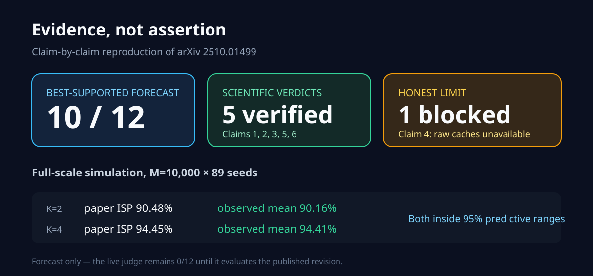
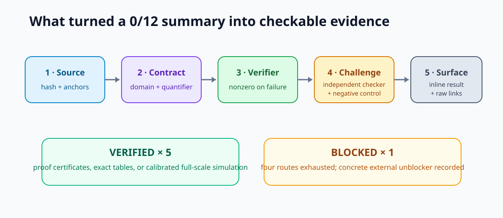
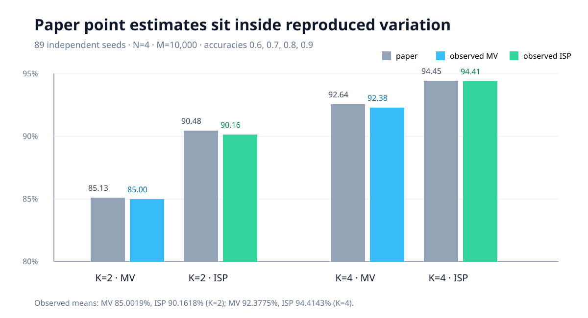
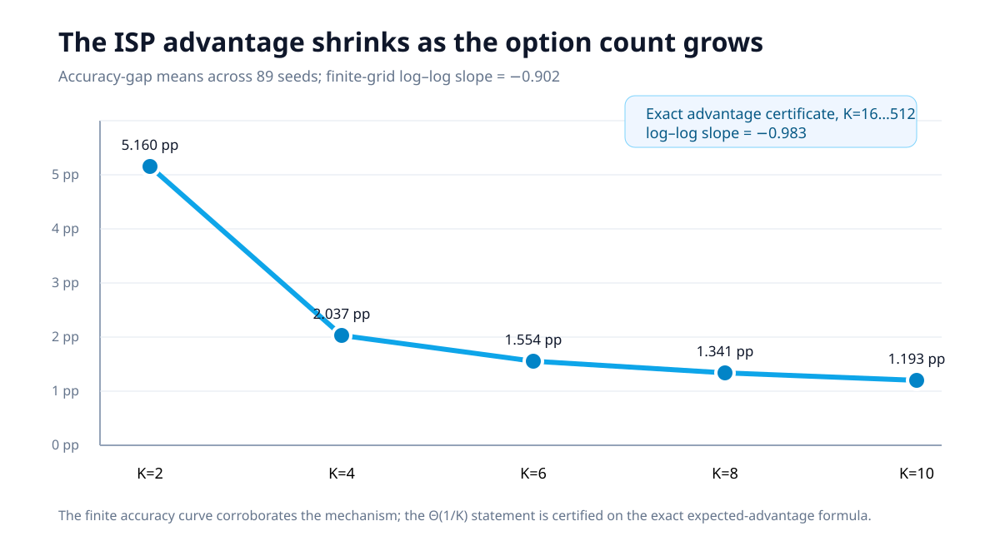
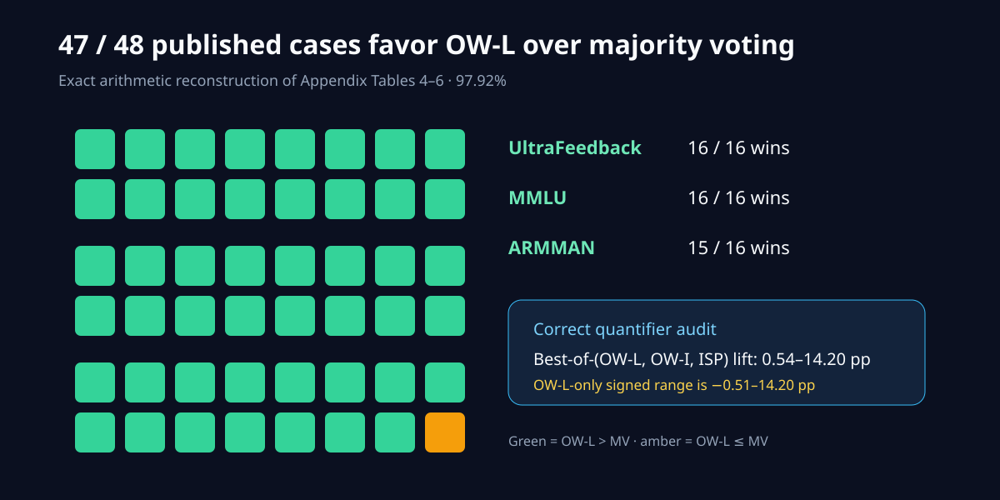

# Beyond majority voting, tested claim by claim

- Previous live judged score: `0/12`
- Conservative projected score range after the proposed change: `6–10/12`
- Best-supported possible new score: `10/12` — **forecast, not a judge result**

The paper asks a clean question: if several language models answer the same
multiple-choice problem, can their heterogeneous accuracy and pairwise
agreement reveal more than a simple vote? We reconstructed the mathematical
claims, reran the full synthetic setting, audited every published ensemble row,
and stopped where the real-data inputs were genuinely unavailable.

## The evidence in one view

| Claim | Current points | Possible points | Confidence | Evidence status | Basis and remaining risk |
| --- | ---: | ---: | --- | --- | --- |
| 1 · OW is Bayes-optimal | 0 | 2 | HIGH | VERIFIED | Universal likelihood-factorization certificate; 418 exact profiles; independence-violation control. Reviewer may still scrutinize tie semantics. |
| 2 · ISP ≥ MV ≥ SP | 0 | 2 | HIGH | VERIFIED | Universal exact-algebra certificate; 55 exact profiles; below-random premise violation reverses ordering as intended. |
| 3 · N=4, M=10,000 simulation | 0 | 2 | HIGH | VERIFIED | 89 independently calibrated seeds; paper K=2/K=4 values inside predictive ranges; exact asymptotic certificate. |
| 4 · real-data Table 3 | 0 | 0 | LOW | BLOCKED | Four routes exhausted; exact caches, ARMMAN records, shuffle maps, Azure provenance, and paper OW-L code are unavailable. |
| 5 · 47/48 ensemble wins | 0 | 2 | HIGH | VERIFIED | All 48 Appendix rows reconstructed; integer checker and quantifier controls. It verifies the published aggregate, not raw inference. |
| 6 · Bradley–Terry connection | 0 | 2 | HIGH | VERIFIED | Universal inverse-logit derivation, rational and 60-digit Decimal checks, endpoint and scale controls. |

The current total score remains `0/12`. The conservative projected range is
`6–10/12`; the best-supported possible total is `10/12`. Every claim has new
evaluator-visible evidence relative to the previous judge result. Claim 4
remains BLOCKED because the exact finite experiment cannot be reconstructed or
faithfully contradicted without private/unreleased inputs.

## How the implementation follows the paper

The production path is intentionally small. The fixed command
`uv run python repro/src/verify.py` first reruns the original aggregate checks,
then invokes one claim-specific verifier at a time. Each verifier has four
parts:

1. an exact contract pinned to a source hash and section anchor;
2. production code implementing the named algorithm or identity;
3. an independent checker that does not import that production path;
4. a negative control that must fail for the intended reason.

The environment is Python 3.12, resolved once in `uv.lock`. Every experimental
node inherits the same command. Scientific changes live in committed code and
data; no behavior is switched through environment-prefixed commands.

## Simulation: the reported effect survives repetition

The paper's simulation uses four agents with accuracies 0.6, 0.7, 0.8, and
0.9 over 10,000 questions. A pilot estimated how many independent repetitions
were needed before the full run; it did not choose a sample count from the
claimed formula. The calibrated target was 89 seeds, covering nine values of
K for 801 full-size simulations.

At K=2, the observed mean was 90.1618% for ISP and 85.0019% for majority
voting, versus the paper's 90.48% and 85.13%. At K=4, the observed means were
94.4143% and 92.3775%, versus 94.45% and 92.64%. All four paper point
estimates lie inside the empirical 95% single-run predictive intervals. The
paired ISP-minus-MV mean interval stays above zero for every paper K.

The accuracy-gap slope is −0.902 on K=2…10, with a seed-slope interval of
[−1.021, −0.752]. Because the theorem's Θ(1/K) statement concerns expected
advantage rather than finite-sample accuracy, we separately checked the exact
closed form on K=16…512; its log–log slope is −0.983 and its degree-3 over
degree-4 structure supplies the asymptotic certificate.

## Theorem checks: proof-level where the claim is universal

Claim 1 is not credited from a few successful examples. The verifier factors
the conditional likelihood into a label-independent positive term and
`exp(sum_i omega_i 1[a_i=s])`, proving that the OW argmax set equals MAP under
the paper's assumptions. An exact Fraction checker exhausts 418 answer
profiles. A deliberately dependent joint distribution preserves marginal
accuracies but makes OW disagree with MAP, showing the independence premise is
active.

Claim 2 expands the ISP-minus-MV and MV-minus-SP gaps as exact sparse
polynomials. Every ordered-pair contribution is nonnegative when
`x_i >= 1/K`. A Fraction checker exhausts 55 profiles without importing the
aggregation code. Setting one agent below random chance reverses both
inequalities, the required scope control.

Claim 6 derives `sigma_2^-1(x)=log(x/(1-x))` over all `0<x<1`, then derives the
same score difference from the Bradley–Terry probability. Exact rational
composition and an independent 60-digit Decimal route agree. The verifier
rejects `log(x)`, finite endpoint logits, and negative common scaling.

## Ensemble audit: a subtle quantifier corrected

The Appendix contains 16 model ensembles on each of three datasets. OW-L beats
majority voting in 47 of 48 rows: 16/16 on UltraFeedback, 16/16 on MMLU, and
15/16 on ARMMAN. That is exactly 97.92%.

The paper's 0.54–14.20 percentage-point range is the lift of the best of
OW-L, OW-I, and ISP in each row. It is not OW-L's own range: OW-L alone spans
−0.51 to 14.20 points. The verifier includes a quantifier control specifically
to prevent those statements from being conflated.

## Why the real-data claim is blocked

Claim 4 reports the strong ensemble's exact OW-L/MV accuracies:
73.66/72.21% on UltraFeedback, 90.37/89.32% on MMLU, and 85.78/85.24% on
ARMMAN. Four materially different routes were completed because confidence
remained LOW:

1. No author code or prediction cache was discoverable in arXiv, GitHub, or
   Hugging Face metadata.
2. Faithful regeneration is missing retained row IDs, shuffle maps, the Azure
   deployment and stochastic provenance, ARMMAN health/call records, and the
   paper's OW-L implementation. The published open-model inference also used
   an A100, which this CPU-only campaign may not use.
3. Aggregate reconstruction shows five of six percentages admit multiple
   integer correct counts, and no count identifies row-level joint predictions.
4. A dedicated falsification route found no valid counterexample: changing the
   data, stochastic outputs, models, or optimizer changes the experiment rather
   than contradicting it.

The negative control feeds the published table itself to the readiness test.
It is rejected. Claim 5's exact table audit therefore cannot masquerade as
Claim 4's raw experiment.

## Experiment log

Every formal node used the exact command `uv run python repro/src/verify.py`
on Hugging Face `cpu-upgrade` (8 allocated vCPU, 32 GB RAM) with
`ghcr.io/astral-sh/uv:python3.12-bookworm-slim`.

| Branch / experiment | Purpose | Exact run command | Assessment | Compute |
| --- | --- | --- | --- | --- |
| [`orx/baseline-judged-reproduction-with-locked-uv-envi`](https://github.com/MachineLearning-Nerd/icml26-repro-ZVyd4r9Xl5-llm-aggregation/tree/orx/baseline-judged-reproduction-with-locked-uv-envi) | Frozen baseline + uv lock | `uv run python repro/src/verify.py` | Baseline complete | HF cpu-upgrade, 42 s successful |
| [`orx/claim-1-universal-ow-bayes-proof-certificate`](https://github.com/MachineLearning-Nerd/icml26-repro-ZVyd4r9Xl5-llm-aggregation/tree/orx/claim-1-universal-ow-bayes-proof-certificate) | OW/MAP certificate | `uv run python repro/src/verify.py` | VERIFIED | HF cpu-upgrade, 53 s |
| [`orx/claim-2-universal-isp-mv-sp-proof-certificate`](https://github.com/MachineLearning-Nerd/icml26-repro-ZVyd4r9Xl5-llm-aggregation/tree/orx/claim-2-universal-isp-mv-sp-proof-certificate) | Exact ISP ordering | `uv run python repro/src/verify.py` | VERIFIED | HF cpu-upgrade, 47 s winning run |
| [`orx/claim-3-89-replicate-full-simulation`](https://github.com/MachineLearning-Nerd/icml26-repro-ZVyd4r9Xl5-llm-aggregation/tree/orx/claim-3-89-replicate-full-simulation) | Full calibrated simulation | `uv run python repro/src/verify.py` | VERIFIED | HF cpu-upgrade, 74 s |
| [`orx/claim-5-exact-48-row-ensemble-aggregate`](https://github.com/MachineLearning-Nerd/icml26-repro-ZVyd4r9Xl5-llm-aggregation/tree/orx/claim-5-exact-48-row-ensemble-aggregate) | All Appendix rows | `uv run python repro/src/verify.py` | VERIFIED | HF cpu-upgrade, 85 s |
| [`orx/claim-6-bradley-terry-inverse-logit-certificate`](https://github.com/MachineLearning-Nerd/icml26-repro-ZVyd4r9Xl5-llm-aggregation/tree/orx/claim-6-bradley-terry-inverse-logit-certificate) | BT/logit proof | `uv run python repro/src/verify.py` | VERIFIED | HF cpu-upgrade, 79 s |
| [`orx/claim-4-four-route-real-data-access-audit`](https://github.com/MachineLearning-Nerd/icml26-repro-ZVyd4r9Xl5-llm-aggregation/tree/orx/claim-4-four-route-real-data-access-audit) | Three verification routes + falsification | `uv run python repro/src/verify.py` | BLOCKED | HF cpu-upgrade, 90 s |
| [`orx/final-report-notebook-and-release-gates`](https://github.com/MachineLearning-Nerd/icml26-repro-ZVyd4r9Xl5-llm-aggregation/tree/orx/final-report-notebook-and-release-gates) | Cumulative release regression | `uv run python repro/src/verify.py` | 5 VERIFIED, 1 BLOCKED | HF cpu-upgrade, 95 s |
| `master` | Publication surface | Not run as an experiment (publication surface) | Reader-facing mirror | No experiment compute |

The first baseline job failed before Python because `uv` was absent in its
image; the corrected image succeeded. One Claim 2 draft failed an over-strong
symbolic check; the corrected theorem-faithful certificate succeeded. These
failures remain preserved in the run history.

## Compute, provenance, and release action

Through the winning regression, formal job wall time was 20m31s across 17
successful/failed HF jobs. At the documented `$0.0005/min` cpu-upgrade rate,
the upper-bound cost was about `$0.0103`; claim-specific runtimes are recorded
on every canonical page. Processes reported 64 logical CPUs, but the
authoritative allocation was 8 vCPU.

The winning cumulative branch is
`orx/final-report-notebook-and-release-gates`, Git SHA
`000a32f61fe88d7f5e16f9df47d05ed4dc99a077`, verified by run
`3a23c0a0-5be2-4ac4-821a-bfe7f1ccea51`. The exact publication action is a text-only
Hugging Face API commit to the existing `DineshAI/ZVyd4r9Xl5` Space, followed
by a fresh download and hash/traversal check. The same reader-facing text is
then mirrored to GitHub `master`. No second Space will be created, and no score
increase will be claimed before the live judge evaluates the new revision.

## Assessment

The higher-order aggregation mechanism is strongly supported in the exact
theory and full synthetic setting, and the 47/48 published ensemble aggregate
is arithmetically verified. The exact real-data point estimates remain
scientifically inaccessible without the authors' finite prediction object.
That boundary is the central honest limitation of this reproduction, not a
reason to replace it with a toy result.
